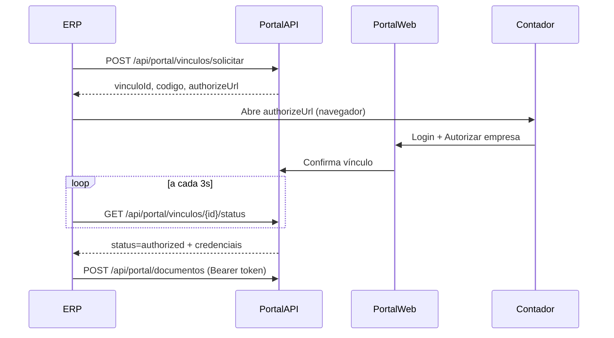

# Portal do Contador — API de Vínculo ERP ↔ Portal

Especificação para o time do portal implementar o fluxo **prático de autorização**, sem copiar token manualmente.

## Objetivo

1. No **ERP**, o usuário clica em **Conectar ao Portal**.
2. O ERP envia os dados da empresa (CNPJ, razão social, etc.).
3. O **contador** abre o portal, vê a solicitação e clica em **Autorizar**.
4. O ERP recebe automaticamente: `token`, `empresaId`, `apiUrl` e dados do contador.
5. O envio de documentos passa a funcionar sem configuração manual.

---

## Fluxo resumido



---

## 1. Solicitar vínculo

**POST** `/api/portal/vinculos/solicitar`  
**Auth:** não requer (público, dados não sensíveis)

### Request

```json
{
  "cnpj": "22.469.772/0001-00",
  "razaoSocial": "MINHA EMPRESA LTDA",
  "nomeFantasia": "MINHA EMPRESA",
  "ie": "123456789",
  "email": "financeiro@empresa.com.br",
  "cidade": "Chapecó",
  "uf": "SC",
  "erpOrigem": "unitec-erp-web",
  "erpEmpresaId": "1"
}
```

| Campo | Obrigatório | Descrição |
|-------|-------------|-----------|
| cnpj | Sim | CNPJ formatado ou só dígitos |
| razaoSocial | Sim | Razão social da empresa |
| nomeFantasia | Não | Nome fantasia |
| ie | Não | Inscrição estadual |
| email | Não | E-mail da empresa |
| cidade / uf | Não | Localização |
| erpOrigem | Sim | Identificador fixo: `unitec-erp-web` |
| erpEmpresaId | Sim | ID interno da empresa no ERP |

### Response `201`

```json
{
  "vinculoId": "8f3c2a1b-9d4e-4f5a-b6c7-8d9e0f1a2b3c",
  "codigo": "A7B9-C3D2",
  "authorizeUrl": "https://unitecnologiasc.com.br/portal/vincular?codigo=A7B9-C3D2",
  "expiresAt": "2026-07-09T16:15:00-03:00"
}
```

| Campo | Descrição |
|-------|-----------|
| vinculoId | UUID para o ERP consultar status |
| codigo | Código curto exibido na tela (contador pode digitar se preferir) |
| authorizeUrl | Link para o contador autorizar no navegador |
| expiresAt | Validade da solicitação (sugestão: **15 minutos**) |

---

## 2. Consultar status do vínculo

**GET** `/api/portal/vinculos/{vinculoId}/status`  
**Auth:** não requer (o UUID já é o segredo; expira em 15 min)

### Response `200` — pendente

```json
{
  "status": "pending",
  "expiresAt": "2026-07-09T16:15:00-03:00",
  "empresa": {
    "cnpj": "22.469.772/0001-00",
    "razaoSocial": "MINHA EMPRESA LTDA"
  }
}
```

### Response `200` — autorizado

```json
{
  "status": "authorized",
  "authorizedAt": "2026-07-09T16:05:00-03:00",
  "credenciais": {
    "token": "eyJhbGciOiJIUzI1NiIs...",
    "empresaId": "42",
    "apiUrl": "https://unitecnologiasc.com.br/api/portal/documentos",
    "contador": {
      "id": "7",
      "nome": "EBSON CONTADOR",
      "email": "contador@escritorio.com.br"
    },
    "empresa": {
      "id": "42",
      "cnpj": "22.469.772/0001-00",
      "razaoSocial": "MINHA EMPRESA LTDA"
    }
  }
}
```

### Outros status

| status | Significado |
|--------|-------------|
| `pending` | Aguardando contador autorizar |
| `authorized` | Vínculo concluído — retornar `credenciais` |
| `rejected` | Contador recusou |
| `expired` | Código expirou |

### Response `404`

Vínculo inexistente ou expirado.

---

## 3. Tela web do portal (contador)

Rota sugerida: `/portal/vincular?codigo=A7B9-C3D2`

1. Contador faz login (já existe cadastro de contador).
2. Exibe dados recebidos do ERP: CNPJ, razão social, fantasia, cidade/UF.
3. Botões: **Autorizar envio de documentos** | **Recusar**.
4. Ao autorizar:
   - Cria ou localiza empresa no portal pelo CNPJ.
   - Vincula empresa ao escritório/contador logado.
   - Gera token Bearer exclusivo para essa empresa.
   - Marca vínculo como `authorized`.

---

## 4. Envio de documentos (já existente)

**POST** `/api/portal/documentos`  
**Auth:** `Authorization: Bearer {token}`

```json
{
  "cnpj": "22.469.772/0001-00",
  "tipo": "NF_EMITIDA",
  "numero": "26",
  "dataEmissao": "2026-07-09",
  "competencia": "2026-07",
  "chaveAcesso": "42260722469772000100550010000000261265359931",
  "xmlContent": "<nfeProc>...</nfeProc>",
  "nomeArquivo": "42260_NF26.xml"
}
```

| tipo | Uso |
|------|-----|
| `NF_EMITIDA` | NF-e / NFC-e autorizada |
| `NF_CANCELADA` | NF-e / NFC-e cancelada |
| `XML_COMPRA` | XML de compra / nota de fornecedor |

O token gerado no vínculo deve aceitar documentos **somente** do CNPJ autorizado.

---

## 5. Revogar vínculo (opcional, fase 2)

**POST** `/api/portal/vinculos/{vinculoId}/revogar`  
**Auth:** Bearer token da empresa

Invalida o token no portal. O ERP pode solicitar novo vínculo.

---

## 6. Regras de segurança

- Código de vínculo expira em **15 minutos**.
- Token é por empresa + contador (não compartilhar entre CNPJs).
- Rate limit em `/solicitar` (ex.: 10/hora por CNPJ).
- Log de auditoria: quem autorizou, quando, de qual IP.

---

## 7. O que o ERP já implementa

- Botão **Conectar ao Portal** na aba Parâmetros → Portal do Contador.
- Envio automático de `solicitar` com dados da empresa cadastrada.
- Polling do status a cada 3 segundos até autorizar/expirar.
- Preenchimento automático de URL, token, ID da empresa e e-mail do contador.
- Envio de documentos no formato acima após vínculo.

**Base URL padrão:** `https://unitecnologiasc.com.br`  
(Configurável via `CONTADOR_CLOUD_PORTAL_BASE_URL` no `.env` do ERP)

---

## Checklist para o portal

- [ ] `POST /api/portal/vinculos/solicitar`
- [ ] `GET /api/portal/vinculos/{id}/status`
- [ ] Tela `/portal/vincular?codigo=...`
- [ ] Geração de token Bearer por empresa vinculada
- [ ] `POST /api/portal/documentos` validando token + CNPJ
- [ ] (Opcional) Revogação de vínculo
