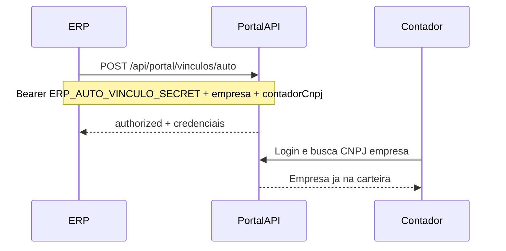
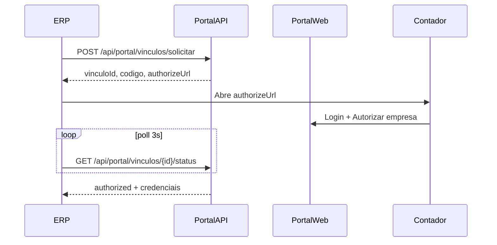

# Portal do Contador — API de Vínculo ERP ↔ Portal

Especificação para o time do portal. Inclui o fluxo legado (autorização manual) e o **vínculo automático** (prioridade).

## Objetivo (fluxo desejado — prioridade)

1. No **ERP**, o usuário escolhe o contador (CNPJ) e clica **Conectar ao Portal**.
2. O ERP envia dados da empresa + **CNPJ do contador**.
3. Se o contador existir e estiver ativo no portal: **autoriza na hora**, coloca a empresa na carteira dele e devolve `token` + `empresaId` + `apiUrl`.
4. O contador só entra no portal e busca pelo **CNPJ do cliente** — sem clicar em Autorizar.
5. O envio de documentos passa a funcionar sem configuração manual de token.

Fluxo legado (`solicitar` + Autorizar) permanece como **fallback**.

---

## Fluxo automático (novo)


```mermaid
sequenceDiagram
    participant ERP
    participant PortalAPI
    participant Contador

    ERP->>PortalAPI: POST /api/portal/vinculos/auto
    Note over ERP,PortalAPI: Bearer ERP_AUTO_VINCULO_SECRET + empresa + contadorCnpj
    PortalAPI-->>ERP: authorized + credenciais
    Contador->>PortalAPI: Login e busca CNPJ empresa
    PortalAPI-->>Contador: Empresa ja na carteira
```

### `POST /api/portal/vinculos/auto`

**Auth:** `Authorization: Bearer {ERP_AUTO_VINCULO_SECRET}`

Segredo exclusivo compartilhado entre ERP e portal (Replit Secret / `.env` do ERP). **Não** reutilizar senha administrativa nem o token da empresa usado em `POST /documentos`.

Sem o header (ou valor incorreto): portal deve responder `401`/`403`.

#### Request

```json
{
  "cnpj": "22.469.772/0001-00",
  "razaoSocial": "MINHA EMPRESA LTDA",
  "nomeFantasia": "MINHA EMPRESA",
  "ie": "123456789",
  "email": "financeiro@empresa.com.br",
  "cidade": "Chapecó",
  "uf": "SC",
  "erpOrigem": "unitec-erp-web",
  "erpEmpresaId": "1",
  "cnpjContador": "12.345.678/0001-90",
  "contadorCnpj": "12.345.678/0001-90",
  "emailContador": "contador@escritorio.com.br"
}
```

| Campo | Obrigatório | Descrição |
|-------|-------------|-----------|
| (campos da empresa) | igual ao `solicitar` | Ver seção 1 abaixo |
| cnpjContador | Sim | CNPJ (ou CPF) do escritório no portal (nome canônico no portal) |
| contadorCnpj | Não | Alias enviado pelo ERP (compatibilidade) |
| emailContador / contadorEmail | Não | Ajuda a casar o cadastro do contador |

Aceitar também `contadorCpf` se o cadastro for de pessoa física.

#### Response `201` — autorizado na hora

```json
{
  "vinculoId": "8f3c2a1b-9d4e-4f5a-b6c7-8d9e0f1a2b3c",
  "status": "authorized",
  "authorizedAt": "2026-09-11T21:00:00-03:00",
  "credenciais": {
    "token": "…",
    "empresaId": "42",
    "apiUrl": "https://unitecnologiasc.com.br/api/portal/documentos",
    "contador": {
      "id": "7",
      "nome": "EBSON CONTADOR",
      "email": "contador@escritorio.com.br",
      "cnpj": "12.345.678/0001-90"
    },
    "empresa": {
      "id": "42",
      "cnpj": "22.469.772/0001-00",
      "razaoSocial": "MINHA EMPRESA LTDA"
    }
  }
}
```

**Não** retornar `pending` neste endpoint. Token deve funcionar imediatamente em `POST /api/portal/documentos`.

#### Erros

| HTTP | Código / body | Significado |
|------|---------------|-------------|
| 404 | `contador_nao_encontrado` | Contador não cadastrado/ativo no portal |
| 409 | `empresa_vinculada_outro_contador` | Empresa já ligada a outro escritório |
| 422 | validação | CNPJ inválido / campos obrigatórios |

#### Regras

- Contador precisa estar **cadastrado e ativo**.
- Empresa aparece **na hora** na carteira do contador (busca por CNPJ).
- Idempotência: mesmo par empresa+contador → reusa/renova token sem duplicar cliente.
- Mostrar origem `unitec-erp-web` + data do vínculo (auditoria).
- Rate limit (ex.: 10/hora por CNPJ empresa).

---

## Fluxo legado (fallback)


```mermaid
sequenceDiagram
    participant ERP
    participant PortalAPI
    participant PortalWeb
    participant Contador

    ERP->>PortalAPI: POST /api/portal/vinculos/solicitar
    PortalAPI-->>ERP: vinculoId, codigo, authorizeUrl
    ERP->>Contador: Abre authorizeUrl
    Contador->>PortalWeb: Login + Autorizar empresa
    loop poll 3s
        ERP->>PortalAPI: GET /api/portal/vinculos/{id}/status
    end
    PortalAPI-->>ERP: authorized + credenciais
```

---

## 1. Solicitar vínculo (legado)

**POST** `/api/portal/vinculos/solicitar`  
**Auth:** não requer (público, dados não sensíveis)

### Request

```json
{
  "cnpj": "22.469.772/0001-00",
  "razaoSocial": "MINHA EMPRESA LTDA",
  "nomeFantasia": "MINHA EMPRESA",
  "ie": "123456789",
  "email": "financeiro@empresa.com.br",
  "cidade": "Chapecó",
  "uf": "SC",
  "erpOrigem": "unitec-erp-web",
  "erpEmpresaId": "1"
}
```

| Campo | Obrigatório | Descrição |
|-------|-------------|-----------|
| cnpj | Sim | CNPJ formatado ou só dígitos |
| razaoSocial | Sim | Razão social da empresa |
| nomeFantasia | Não | Nome fantasia |
| ie | Não | Inscrição estadual |
| email | Não | E-mail da empresa |
| cidade / uf | Não | Localização |
| erpOrigem | Sim | Identificador fixo: `unitec-erp-web` |
| erpEmpresaId | Sim | ID interno da empresa no ERP |

### Response `201`

```json
{
  "vinculoId": "8f3c2a1b-9d4e-4f5a-b6c7-8d9e0f1a2b3c",
  "codigo": "A7B9-C3D2",
  "authorizeUrl": "https://unitecnologiasc.com.br/portal/vincular?codigo=A7B9-C3D2",
  "expiresAt": "2026-07-09T16:15:00-03:00"
}
```

| Campo | Descrição |
|-------|-----------|
| vinculoId | UUID para o ERP consultar status |
| codigo | Código curto exibido na tela |
| authorizeUrl | Link para o contador autorizar no navegador |
| expiresAt | Validade da solicitação (sugestão: **15 minutos**) |

---

## 2. Consultar status do vínculo

**GET** `/api/portal/vinculos/{vinculoId}/status`  
**Auth:** não requer (o UUID já é o segredo; expira em 15 min)

### Response `200` — pendente

```json
{
  "status": "pending",
  "expiresAt": "2026-07-09T16:15:00-03:00",
  "empresa": {
    "cnpj": "22.469.772/0001-00",
    "razaoSocial": "MINHA EMPRESA LTDA"
  }
}
```

### Response `200` — autorizado

```json
{
  "status": "authorized",
  "authorizedAt": "2026-07-09T16:05:00-03:00",
  "credenciais": {
    "token": "eyJhbGciOiJIUzI1NiIs...",
    "empresaId": "42",
    "apiUrl": "https://unitecnologiasc.com.br/api/portal/documentos",
    "contador": {
      "id": "7",
      "nome": "EBSON CONTADOR",
      "email": "contador@escritorio.com.br"
    },
    "empresa": {
      "id": "42",
      "cnpj": "22.469.772/0001-00",
      "razaoSocial": "MINHA EMPRESA LTDA"
    }
  }
}
```

### Outros status

| status | Significado |
|--------|-------------|
| `pending` | Aguardando contador autorizar |
| `authorized` | Vínculo concluído — retornar `credenciais` |
| `rejected` | Contador recusou |
| `expired` | Código expirou |

### Response `404`

Vínculo inexistente ou expirado.

---

## 3. Tela web do portal (contador)

### Fluxo automático

Contador faz login → busca CNPJ do cliente → empresa **já está** na carteira (criada pelo `/vinculos/auto`).

### Fluxo legado

Rota: `/portal/vincular?codigo=A7B9-C3D2`

1. Contador faz login.
2. Exibe dados do ERP.
3. Botões: **Autorizar** | **Recusar**.
4. Ao autorizar: cria/localiza empresa, vincula, gera token, marca `authorized`.

---

## 4. Envio de documentos

**POST** `/api/portal/documentos`  
**Auth:** `Authorization: Bearer {token}`

```json
{
  "cnpj": "22.469.772/0001-00",
  "tipo": "NF_EMITIDA",
  "numero": "26",
  "dataEmissao": "2026-07-09",
  "competencia": "2026-07",
  "modelo": "65",
  "contingencia": false,
  "tpEmis": 1,
  "chaveAcesso": "42260722469772000100550010000000261265359931",
  "xmlContent": "<nfeProc>...</nfeProc>",
  "nomeArquivo": "42260_NF26.xml"
}
```

| tipo | Uso |
|------|-----|
| `NF_EMITIDA` | NF-e / NFC-e autorizada na SEFAZ |
| `NF_CANCELADA` | NF-e / NFC-e cancelada |
| `NF_CONTINGENCIA` | Ainda em contingência — **avisar o contador** |
| `XML_COMPRA` | XML de compra / nota de fornecedor |

### Campos extras (ERP já envia)

| Campo | Tipo | Descrição |
|-------|------|-----------|
| `modelo` | string | `55` = NF-e, `65` = NFC-e |
| `contingencia` | bool | `true` se contingência |
| `tpEmis` | int | `1` normal, `9` contingência |
| `motivoContingencia` | string | Justificativa |

### Pedidos de UI no portal

1. Rotular NFC-e vs NF-e pelo `modelo`.
2. Badge Contingência quando `NF_CONTINGENCIA` ou `contingencia=true`.
3. Ao receber `NF_EMITIDA` da mesma `chaveAcesso`, limpar alerta.

---

## 5. Revogar vínculo (opcional)

**POST** `/api/portal/vinculos/{vinculoId}/revogar`  
**Auth:** Bearer token da empresa

---

## 6. Segurança

- Código legado expira em **15 minutos**.
- Token por empresa + contador.
- Rate limit em `/solicitar` e `/auto`.
- Auditoria: quem vinculou, quando, IP.

---

## 7. ERP Unitec

- **Conectar** tenta `/vinculos/auto` com Bearer `ERP_AUTO_VINCULO_SECRET` + CNPJ do contador vinculado; fallback para `solicitar` + poll.
- Segredo padrão em `config/contador-cloud.php` (vai no ZIP de update); `.env` `ERP_AUTO_VINCULO_SECRET` só sobrescreve.
- Preenche token/URL/ID automaticamente.
- Envia `modelo` / `contingencia` / `tpEmis`.

**Base URL:** `https://unitecnologiasc.com.br` (`CONTADOR_CLOUD_PORTAL_BASE_URL`)

Pedido resumido: [portal-contador-pedido-melhorias.md](portal-contador-pedido-melhorias.md).

---

## Checklist portal

- [x] `POST /api/portal/vinculos/solicitar`
- [x] `GET /api/portal/vinculos/{id}/status`
- [x] Tela `/portal/vincular?codigo=...`
- [x] Token Bearer + `POST /api/portal/documentos`
- [ ] **`POST /api/portal/vinculos/auto`** (prioridade)
- [ ] Auth Bearer `ERP_AUTO_VINCULO_SECRET` (exclusivo)
- [ ] Empresa na carteira na hora (busca CNPJ)
- [ ] Erro `contador_nao_encontrado`
- [ ] Rotular NFC-e vs NF-e (`modelo`)
- [ ] Badge contingência
- [ ] (Opcional) Revogar vínculo
